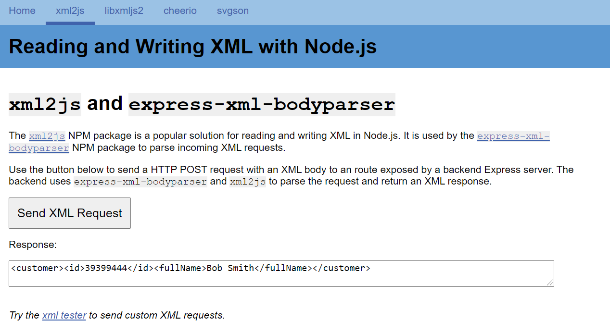
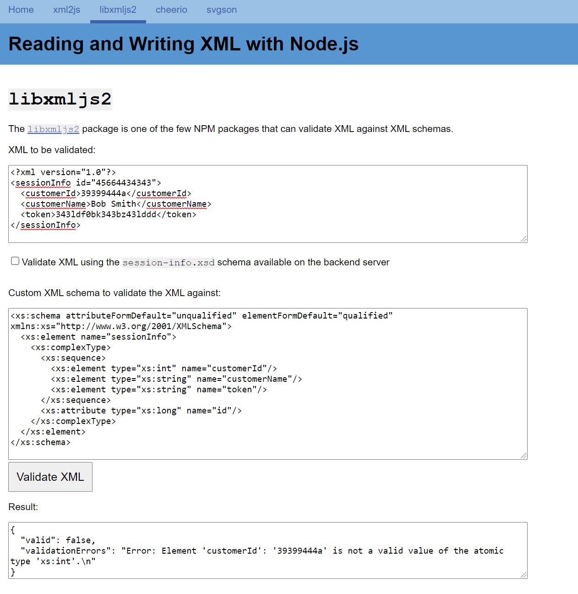
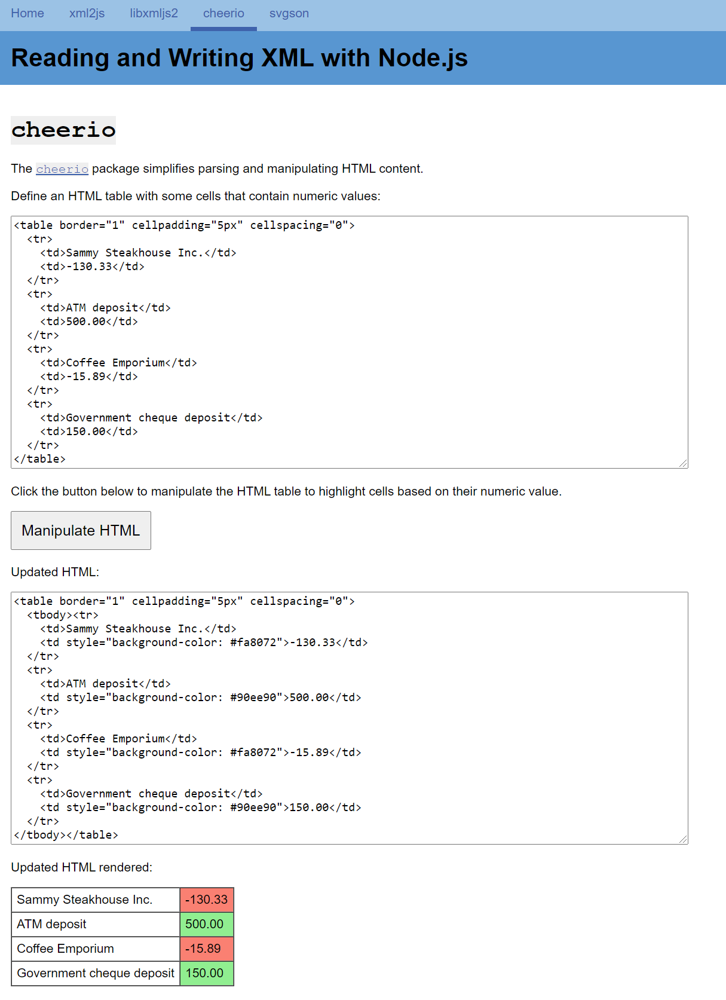
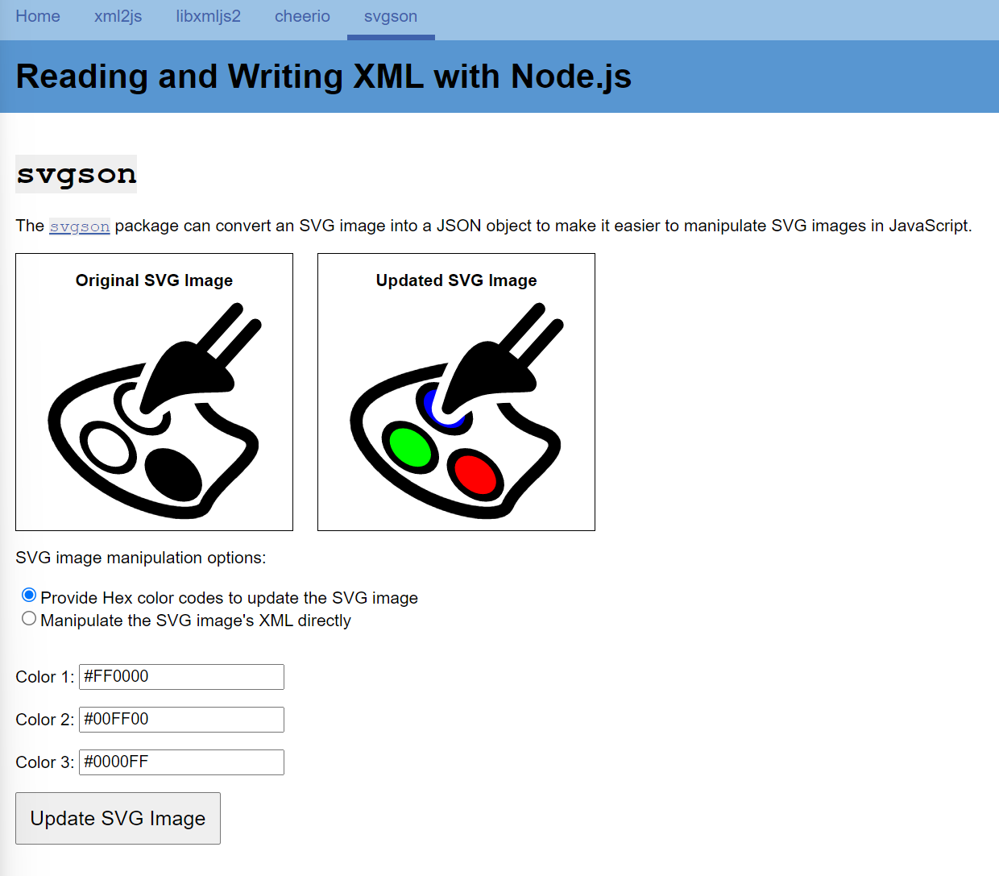

# Reading and Writing XML in Node - Demo App

A simple Node.js Express web app that demonstrates some common packages that help with reading and writing XML in Node.js applications.

## xml2js and express-xml-bodyparser

## libxmljs2

## cheerio

## svgson

